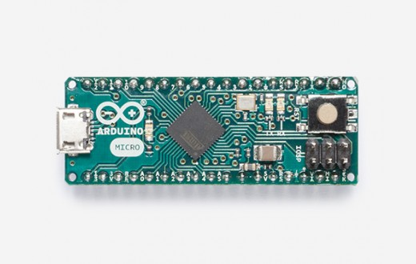
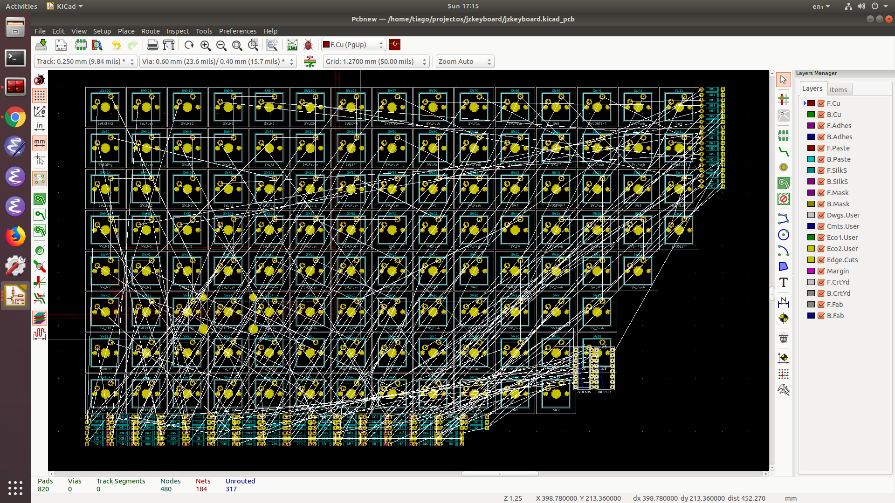

# Designing and building a keyboard from scratch - part 2

## The innards of a keyboard

Conceptually a keyboard is a collection of 100 or so individual switches all connected to a circuit that continuously senses their state and reports any change to the connected computer. You press a key, a message is sent with the key's numeric code and the fact it was pressed. You release it, another message is sent. 

Nowadays the common way to transfer these messages is through USB.

Generating USB messages with a custom built circuit is not trivial. The smart way to do it is to use a microcontroller that can natively speak USB. A microcontroller is a chip that contains a CPU, RAM and ROM and input/output devices.

Most non commercial mechanical keyboards use one of the following microcontrollers:

 - Atmega32u4
 - Teensy
 - Stm32
 
The atmega32u4 is the heart of, for example, the Arduino Leonardo and the Arduino pro micro. Being open source, there are really cheap versions of these boards available in the usual chinese websites. The Pro micro was my choice as it is small enough I can fit it under the keyboard PCB. 

This little guy has 2KB of RAM, 1KB of EEPROM. It runs plenty fast for this application. 

That 1KB of EEPROM is significant because it limits the total memory for dynamic macros to about 500 characters across all 12 macro keys. More on this later.

### The matrix

The atmega32u4 has about 20 general purpose IO pins. It isn't easy to find a cheap microcontroller with enough IO pins so that you can connect 1 switch to 1 pin. 

We therefore need a way to connect 100 switchs to only 20 pins. The usual way to solve this problem is quite interesting: we create a matrix of wires with N rows and M columns. All the switches belonging to the same row have one end connected to the same wire.

The other end of the switches which belong to the same vertical column are also connected together. This creates M vertical wires. 

Here's a nice diagram exemplifying this (taken from a [fantastic blog post](http://blog.komar.be/how-to-make-a-keyboard-the-matrix/) ).

For example, the switches for Q and W are in the same row. One end of these switches is connected to the same row wire. The other end is connected each to its own column wire.

For a matrix with 100 switches we need at least 10 wires for the rows and 10 wires for the columns (using a square matrix). Thus needing only 20pins for 100switches.

In small keyboards we can connect these M wires directly to the microcontroller, as long as the microcontroller has at least N+M free IO pins. At each switch we also connect a diode that goes from the switch to the sensing wire. We need the diodes to prevent issues when multiple keys are pressed at the same time. I'll skip the why but the blog post above expands a lot on that.

To detect if a key is pressed we do the following:

 - Set all the pins connected to columns as outputs and initialize them to a high value.
 - Set all pins connected to rows as input with pull-ups (meaning if nothing is connected to those pins they will be logically high as there are internal resistors the pull them up)
 - We set a single column as low.
 - We read the status of the pins connected to the rows.

Remember that a switch essentially connects a row pin to a column pin. If the switch is open (key not pressed) then there is no electrical connection between the two. Whatever value (electrical potential) we have on the column pin will not be seen at the row pin. When the switch is connected, both pins have the same value.

All the row pins are pre-configured to be in INPUT mode with pull ups so if left unconnected they will always have a HIGH value. When we want to sense if for example the Q key is pressed, then all we need is to keep all columns as HIGH except the column which connects one lead of the Q switch, which we set as LOW. Then we read the state of the row containing the Q switch. If we see a HIGH then we know that key is not pressed, otherwise we see a LOW and the switch has to be closed (key pressed).

We _select_ only one column at a time by setting it to LOW and then read the state of all switches in that column.

Do this fast enough for all columns, one at a time, and no human will be able to press a button and have that go undetected.

You can obviously swap rows and columns. I.e. use column pins for sensing and in fact this is the most common way in other open source keyboards. 

This keyboard has 17 columns and 7 rows. Like I said earlier the rows are used for sensing (input). Also, I couldn't connect directly the 17+7 wires to the microcontroller. The 7 rows are connected directly but the state of the columns is controlled with 3 wires using 3 cascaded shift registers.

The micro has therefore 7+3 IO pins used.

Here's a screenshot of the schematic:

Without going too deep on shift registers, they allow the value of the 17 columns to be controlled using only 3 pins on the micro.

### PCB

A key design decision of this project was to make it modular. The PCB should not be tied to the microcontroller, i.e. it should be possible to use the same switch matrix with different microcontrollers. For this reason, the PCB contiains male connectors and the micro is connected with wires that run underneath the PCB.

There are exactly 3 connectors:

 - 2 pin connector for +vcc and gnd.
 - 3 pin connector to drive the columns via the shift registers.
 - 7 pin connector to read the state of the rows.

One mistake I did here was to put these connectors in opposite corners of the PCB. It seemed sensible at the time given the space available on the PCB but it meant long wires.

Here's a picture of the rows connector at the top left corner:

The first step was to create a schematic, this is fairly simple, you drag a switch component, a diode, then connect them with wires and duplicate this to create first a column, then duplicate the column to get a matrix. Sprinkle with some connectors and you're done with the schematic.

Next step is to assign _footprints_ to the all the components in the schematic. A footprint defines the physical shape and dimensions of each component. Kicad is brilliant that it already brings footprints for Cherry MX switches (as well as thousands of other components). So the task here was to map each switch to the right footprint. (for example, the _shift_ key being wider has a different footprint than most other keys).

Here's the footprint mapping dialog in Kicad:

Once this is done you jump to the PCB layout. What you see is a pile of footprint switches. The task is to drag the right switch to the right place. Essentially a 200 piece puzzle where every component looks like any other.

Here's a picture of it midway:

It is extremely important to set the right grid settings and make the components snap to the grid. I can't remember the grid settings used but there are grid dimension that makes everything snap and align perfectly (as the footprints of Cherry MX switches have well defined dimensions).

At this stage, the electrical traces are not layed out yet, instead, Kicad draws a straight white line between all pairs of points that need a connection. This is called a "ratsnest" view because, well, it looks messy.

Kicad has an _autoroute_ functionality that automatically lays down the electrical traces and makes sure they don't touch when they shouldn't. This didn't work well for me and I had to resort to doing it manually. Basically, for every one of those white lines, there will have to be a copper trace that connects them. Unlike the white lines, the copper traces usually cannot cross each other. So to put a trace you usually have to side step and go around every other trace. This becomes progressively harder to do the more traces you put in. In fact, my first attempt was a failure and I had to restart from scratch.

On the second attempt I've decided to use two copper layers (top and bottom) and then try to stick to vertical traces at the top and horizontal traces at the bottom.
On a single layer there are mostly parallel traces so that reduces the points where they have to cross. A via is used to continue one trace from one layer on the other. A via is literaly a whole that is drilled on the PCB and then filled with conductive material.

Here's a picture of a trace with vias to jump from one layer to the other to work around components already placed.

The red color are traces in one layer and generally can't cross each other, the green traces in the other layer. A via is used to jump from one layer to the other. As a rule of thumb, right angles and vias should be minimized. 

The traces on this PCB are generally OK except near the 3 shift registers where everything got a bit too messy. Everything still works but messy enough that I missed one of the connections. A mistake I only detected after soldering everything and wondering why the board didn't work... One of the shift registers didn't have GND connected.

#### PCB production

With all the components in the right place and the traces drawn, next step is to do a copper pour for the GND plane. Kicad did most of the work here.

From there, we need to create Gerber files. Honestly, I followed a guide online to do this and left most settings as default. The gerber files are all the PCB production companies need to build the PCB as they are fed to the robots for drilling etc.

I've used JLCPCB for building the PCB. Minimum quantity was 5 PCBs. They were fabricated with Lead-free finish (more expensive but better for the environment) and they end up costing about 50gbp with shipping. A brilliant price actually. Still haven't found a company that can beat these prices and I searched a lot.

The production process was dead easy from my perspective. Upload the zip file with the gerber files inside, get an immediate quote, pay. One day later an email arrives confirming everything is validated and production will start. A few days later another email confirming the PCBs were delivered to the carrier for shipping.

Here's a picture of what appeared at the door about 15 days later:

Awesome!

### Soldering

Not much to say here. I had sourced the Gateron Brown switches and a bunch of diodes from aliexpres and I suck at soldering. It took me about two hours of non continuous work to solder everything. Used lead free solder which is a bit hard to work with but still I could see I've gotten progressively better as I went along. 

Glad it was finished though :) Dreading soldering the remaining 4 PCBs.

Here's a pic of the soldering job almost finished:

Let's discuss the firmware design in part 3. Stay tuned.
