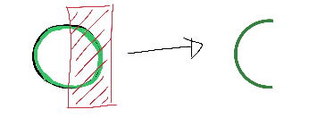
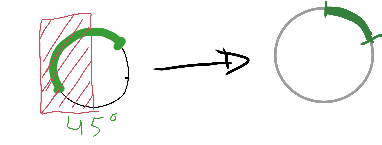

# Build it! - A pure css circular progress bar (draft)

 
This post presents a way to build circular progress bars with only CSS and html. No javascript is executed at the device and no images are loaded. This makes this approach very fast to load and render. To achieve it, some interesting css tricks involving hidding and cutting bits are needed. Shall we?


[Live demo](code/pure_css_circular_progress.html)

# Let's start with a square
A square is just a "block" with both dimensions with the same length. Let's use a div for this.

```html
<div class="progress-circle">
</div>
```

```css
.progress-circle {
   width: 5em;
   height: 5em;
}
```
Here we use em as units as this will allow the control to scale everything based on font-size. 

# Making it round
To make it round, we use an old css trick: If you pick a square and give it a 50% border radius, it becomes a circle.


```css
.progress-circle {
	...
    border-radius: 50%;
	...
}
```

# Drawing a border
The border for the "empty" bit of the progress bar is not a real css border. It is built by having the outer circle with a background color and then overlaying a smaller circle centered on the same point. The reason for this will become clearer further down.
Instead of inserting a new dom element, we'll use an :after pseudo element.


```css
.progress-circle {
	...
    position: relative;
	...
}
.progress-circle:after{ /* This is the smaller "inner" circle.*/
    border: none;		/* It could have one if you wanted a different styling */
    position: absolute;	/* So we can position it with top and left */
    top: 0.25em;		/* We want a 0.25em border "width" so that is our displacement */
    left: 0.25em;
    text-align: center;	
    display: block;		/* Make it blocky */
    border-radius: 50%;	/* and round */
    width: 4.5em;		/* Circle diameter is = outer_diameter - 2*border "width" */
    height: 4.5em;
    background-color: white;
    content: " ";		/* Needed for the after element to actually show */
}
```

# Cliping it!
To make the progress bar we will take a circle with the same diameter as the whole control and hide its right half using the clip() css operator. 




```css
.value-bar {
   /*This is an overlayed square, that is made round with the border radius,
   then it is cut to display only the left half, then rotated clockwise
   to escape the outer clipping path.*/ 
   position: absolute; /*needed for clipping*/
   clip: rect(0, 2.5em, 5em, 0);
   width: 5em;
   height: 5em;
   border-radius: 50%;
   border: 0.45em solid #53777A; /*The border is 0.35 but making it larger removes visual artifacts */
   box-sizing: border-box; 
}
```

```html
<div class="progress-circle">
   <div class="left-half-clipper">
      <div class="value-bar">
   </div>
</div>
```

The .left-half-clipper contains the value-bar making sure only it's right half is visible. This makes the value-bar invisible when the rotation (percentage) is 0 and fully visible at 180deg (50%)


Rotating this half circle by an amount X while hiding what's on the left half, we get the desired progress bar effect. By varying the X from 0 to 180deg, we go from 0 to 50%.




# Rotation values
The rotation values are very simple to compute as the rotation is a linear function of the percentage. I used a spreadsheet to get all values between 0 and 50 (%) and the corresponding rounded rotations. I then created a few css rules hardcoding these values. Here the classes pX are used for the percentage with value X:

```css
...
.progress-circle.p15 .value-bar { transform: rotate(54deg); } /* 15% rotation */
.progress-circle.p16 .value-bar { transform: rotate(58deg); }
.progress-circle.p17 .value-bar { transform: rotate(61deg); }
.progress-circle.p18 .value-bar { transform: rotate(65deg); }
.progress-circle.p19 .value-bar { transform: rotate(68deg); }
...
```

Actually, while at it, expand it to the full 0-100% as these will be needed as well.

```css
.progress-circle.p1 .value-bar { transform: rotate(4deg); }
...
.progress-circle.p100 .value-bar { transform: rotate(360deg); }
```


To represent percentages above 50 we can still keep rotating the bar but we need to force the whole right half to be painted. This is simple enough by using another half circle (this time throwing away its left half.). Used class .first50-bar for this.


```html
<div class="progress-circle p33">
   <span>33%</span>
   <div class="left-half-clipper">
      <div class="first50-bar"></div>
      <div class="value-bar"></div>
   </div>
</div>
<div class="progress-circle over50 p66">
   <span>66%</span>
   <div class="left-half-clipper">
      <div class="first50-bar"></div>
      <div class="value-bar"></div>
   </div>
</div>
```

# Cleaning it up
The final version should have vendor prefixes in the css.

The clip css operator is [marked as deprecated](https://developer.mozilla.org/en-US/docs/Web/CSS/clip) and being replaced by clip-path which in turn is not supported by IE.

